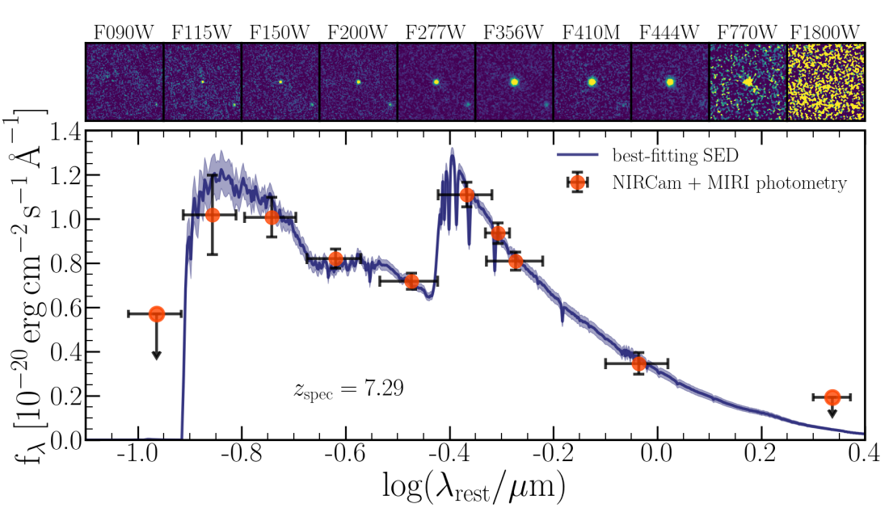

A repository to generate synthetic observations from the FLARES simulations (Lovell et al. 2020; Vijayan et al. 2020) to compare to the massive quiescent galaxy at zspec = 7.29 observed by JWST RUBIES (Weibel et al. 2024).

Seen below is the NIRCam and MIRI imaging cutouts of RUBIES-UDS-QG-z7 along with the NIRCam + MIRI photometry and the modelled SED from Weibel et al. (2024).

To generate the synthetic observations, run `synthesize_rubies.py` with a command in the terminal such as 

`mpirun -np $SLURM_NTASKS python synthesize_rubies.py --grid bpass-2.2.1-bin_chabrier03-0.1,300.0_cloudy-c23.01-sps --grid-dir /cosma7/data/dp276/dc-newm1/data/synthesizer_data/grids --region 00 --snap 3 --nthreads 28 /cosma7/data/dp004/dc-payy1/my_files/flares_pipeline/data/flares.hdf5`

This will require having access to a FLARES master file that is located in COSMA. 
